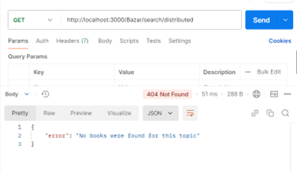

# Bazar.com: A Multi-Tier Online Book Store
*This is the report for both Part 1 and Part 2.*

### Distributed and Operating Systems  
**Bazar.com - The World's Smallest Book Store**


Bazar.com is a simple, multi-tier online bookstore designed as a distributed application. This project demonstrates a RESTful microservices architecture, with separate components for catalog management and order processing.

## Table of Contents
- [Prerequisites](#prerequisites)
- [Setup and Installation](#setup-and-installation)
  - [Using Docker](#using-docker)
    - [Part 1 in Docker](#part-1-in-docker)
    - [Part 2 in Docker](#part-2-in-docker)
  - [If you are not using Docker](#if-you-are-not-using-docker)
- [Part1](#part1)
  - [Testing the APIs](#testing-the-apis)
  - [Sample Outputs](#sample-outputs)
  - [Screenshots](#screenshots)
  - [Program Design](#program-design)
- [Part2](#part2)
  - [program design](#program-design2)
  - [How It Works] 
  - [possible improvements]
  - [How to run the program]
- [Why Node.js](#why-nodejs)
- [Contributors](#contributors)


## Prerequisites
Before running the project, ensure you have the following installed:

- **Docker**
- **Docker Compose**
- **Node.js** (for local development)

## Project Overview
Bazar.com consists of:
- A **front-end server** that handles user requests.
- A **back-end** with two microservices:
  - **Catalog Server**: Manages book inventory with stock counts, pricing, and topic categorization.
  - **Order Server**: Processes purchase orders and manages inventory updates.

## Key Features
- **Catalog Browsing**: Search and view book details by topic.
- **Order Processing**: Make purchases with automatic inventory updates.
- **RESTful Design**: Each component communicates through HTTP REST APIs, allowing modularity and separation of concerns.

## Setup and Installation

### Using Docker
1. Clone the repository to your local machine:
    ```bash
    git clone https://github.com/MasaLubbadeh/DOSProj.git
    cd DOSProj
    ```
#### Part 1 in Docker
2. Build the Docker images and start the containers:
    ```bash
    docker-compose up --build
    ```
     
     
  #### Part 2 in Docker
      
   ### If you are not using Docker
1. Clone the repository to your local machine:

    ```bash
    git clone https://github.com/MasaLubbadeh/DOSProj.git
    cd DOSProj
    ```

2. Open the folder using VSCode or your preferred editor.

3. Navigate into each folder and run each server in separate terminals:

   - **Catalog Server**
     
     

   - **Order Server**
     
     

   - **Frontend**
     
     
## part1
### Testing the APIs
You can test the APIs using Postman or other tools. Here are the endpoints available:

- **Purchase Book**:
  - **Endpoint**: `http://localhost:3000/Bazar/purchase/{id}`
  
- **Get Book Information**:
  - **Endpoint**: `http://localhost:3000/Bazar/info/{id}`

- **Search Books by Topic**:
  - **Endpoint**: `http://localhost:3000/Bazar/search/{topic}`

### Sample Outputs
- For successful purchases, you will receive a message confirming the purchase along with details.
- For unsuccessful purchases (e.g., book not found, out of stock), appropriate error messages will be returned.

### Screenshots
Here are some screenshots of the application in action:

- **When Searching for a Specific Book**:
  
  

   - If the Book is Not Found:
  
  

- **When Searching by Using a Topic**:
  
  

  - If No Books Are Found:
  
  

- **When Making a Purchase**:
  - If the purchase is successful, stock is updated:
    
    

  - If the purchase fails:
    
    

  - If there is no such book:
    
    


- **Output on Docker Console**:
  
  

- **Docker Desktop**:
  
  

### Program Design
#### Overview
Bazar.com is structured as a microservices application, consisting of a **Catalog Server** and an **Order Server**. The Catalog Server handles book information and queries, while the Order Server manages purchase transactions. The frontend connects users to these services seamlessly.

#### How It Works
1. **User Interaction**: There is no frontend to this project,user deals with the provided apis,all requests are sent to the frontend server.
2. **Service Communication**: The frontend makes API calls to the Catalog Server to fetch book details and to the Order Server to process purchases.
3. **Database**: Both servers connect to a database to retrieve and store data as needed.

#### Design Trade-offs
- **Microservices Architecture**: This design allows for better scalability and maintainability. However, it introduces complexity in service management and inter-service communication.
- **Use of Docker**: Containerization simplifies deployment and dependency management, but can require additional resources and initial setup time.

#### Possible Improvements and Extensions
- **User Interface**: Develop a more intuitive and visually appealing user interface to enhance user experience and accessibility.
  
- **Database Integration**: Implement a real database system (such as MongoDB or PostgreSQL) instead of using a file-based storage solution to improve data management, scalability, and performance.

- **Additional APIs**: Add more APIs to expand the functionality of the application, allowing for more features and better integration with other systems or services.

#### Known Issues
- **Performance**: The application may experience latency under heavy load due to synchronous API calls.
- **Error Handling**: Currently, error messages may not provide enough context for debugging.

## Why Node.js
Node.js was chosen for this project due to its non-blocking, event-driven architecture, which allows for efficient handling of multiple connections simultaneously. This makes it ideal for building fast and scalable network applications, especially for an online bookstore where numerous users may access the service concurrently. Additionally, the vast ecosystem of Node.js libraries and packages simplifies development, enabling quicker implementation of features and enhancements.

## Contributors
-Masa Lubbadeh

-Raya Hindi

